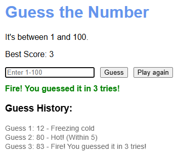

# 🔥 Hot or Cold Number Guessing Game

## Overview

A simple JavaScript number guessing game where the player tries to guess a randomly generated number between **1 and 100**. After each guess, the game provides feedback based on how close the guess is to the correct number.

---

## 🎮 How It Works

- The game generates a random number between **1 and 100**.
- The player enters a guess.
- The game responds with feedback:
  - **Fire!** – Exact match 🎉
  - **Hot! (Within 5 / 10 / 20 / 30 / 40)** – Based on proximity
  - **Freezing cold** – More than 40 numbers away
- The game tracks:
  - Total number of tries
  - Best score (lowest number of guesses)
  - Guess history

---

## 🧠 Features

- Random number generation
- Input validation
- Dynamic feedback messages
- Color-coded hints
- Guess history tracking
- Best score tracking
- “Play Again” reset button
- Press **Enter** to submit a guess

---

## 🛠️ Technologies Used

- HTML
- CSS
- JavaScript (Vanilla JS)
- DOM Manipulation
- Event Listeners

---

## ScreenShots

## 🚀 New Skills Learned
- arrow functions
- .focus
- .innerHTML
- changing text color

---

## 📋 Game Rules

- Only numbers between **1 and 100** are allowed.
- Invalid input will display an error message.
- The fewer guesses you use, the better your score.
- The best score updates automatically when beaten.

---

## 🔄 Resetting the Game

Click the **Play Again** button to:
- Generate a new random number
- Reset tries to 0
- Clear the guess history
- Keep your best score

---

## Author
Etmcev01 - Ethan McEvoy
